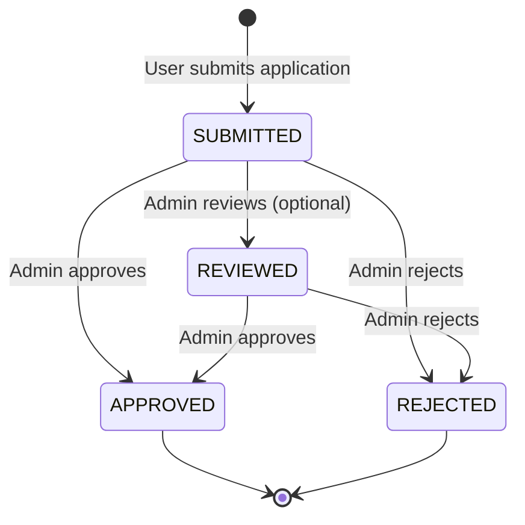

# Admin API Documentation

## Overview

This document describes the admin-specific API endpoints for the Pluto Hub platform. These endpoints are used to manage developer applications and require admin privileges.

**Authentication**: All admin endpoints require a Firebase Bearer token from a user with `role = 'ADMIN'`.

---

## Admin Endpoints

###List Developer Applications

Retrieve a list of developer applications with optional filtering and pagination.

**Endpoint**: `GET /v1/admin/applications`

**Authentication**: Required (Admin role)

**Headers**:
```http
Authorization: Bearer <firebase-id-token>
```

**Query Parameters**:

| Parameter | Type | Required | Description |
|-----------|------|----------|-------------|
| `status` | string | No | Filter by application status (SUBMITTED, REVIEWED, APPROVED, REJECTED) |
| `limit` | number | No | Results per page (default: 20) |
| `offset` | number | No | Pagination offset (default: 0) |

**Response**:
```json
{
  "data": [
    {
      "id": "app-uuid-1",
      "userId": "user-uuid-1",
      "email": "developer@example.com",
      "companyName": "Awesome Games Studio",
      "website": "https://awesomegames.com",
      "description": "We create fun and engaging mobile games",
      "gamesPlanned": "Puzzle games and casual arcade titles",
      "status": "SUBMITTED",
      "submittedAt": "2024-12-31T09:00:00Z",
      "reviewedAt": null,
      "reviewedBy": null,
      "reviewNotes": null,
      "user": {
        "id": "user-uuid-1",
        "uniqueDisplayName": "DevStudio123"
      }
    }
  ],
  "total": 15,
  "limit": 20,
  "offset": 0
}
```

**Error Responses**:

| Status | Code | Description |
|--------|------|-------------|
| 401 | `UNAUTHORIZED` | Missing or invalid Firebase token |
| 403 | `FORBIDDEN` | User is not an admin |

---

### Approve Developer Application

Approve a developer application, granting the user developer access.

**Endpoint**: `PUT /v1/admin/applications/:id/approve`

**Authentication**: Required (Admin role)

**Headers**:
```http
Authorization: Bearer <firebase-id-token>
Content-Type: application/json
```

**URL Parameters**:
- `:id` - Application ID (UUID)

**Request Body**:
```json
{
  "reviewNotes": "Great portfolio, application approved"
}
```

**Request Fields**:

| Field | Type | Required | Description |
|-------|------|----------|-------------|
| `reviewNotes` | string | No | Admin notes on the approval |

**Response**:
```json
{
  "application": {
    "id": "app-uuid-1",
    "userId": "user-uuid-1",
    "status": "APPROVED",
    "reviewedAt": "2024-12-31T09:14:00Z",
    "reviewedBy": "admin-uuid",
    "reviewNotes": "Great portfolio, application approved"
  },
  "user": {
    "id": "user-uuid-1",
    "developerId": "app-uuid-1",
    "developerStatus": "ACTIVE"
  }
}
```

**Side Effects**:
1. Updates application status to `APPROVED`
2. Sets `reviewedAt` to current timestamp
3. Sets `reviewedBy` to admin user ID
4. Updates user's `developerId` to reference the application
5. Sets user's `developerStatus` to `ACTIVE`

**Error Responses**:

| Status | Code | Description |
|--------|------|-------------|
| 401 | `UNAUTHORIZED` | Missing or invalid Firebase token |
| 403 | `FORBIDDEN` | User is not an admin |
| 404 | `NOT_FOUND` | Application not found |
| 409 | `CONFLICT` | Application already approved |

---

### Reject Developer Application

Reject a developer application with required review notes.

**Endpoint**: `PUT /v1/admin/applications/:id/reject`

**Authentication**: Required (Admin role)

**Headers**:
```http
Authorization: Bearer <firebase-id-token>
Content-Type: application/json
```

**URL Parameters**:
- `:id` - Application ID (UUID)

**Request Body**:
```json
{
  "reviewNotes": "Incomplete information provided. Please reapply with more details."
}
```

**Request Fields**:

| Field | Type | Required | Description |
|-------|------|----------|-------------|
| `reviewNotes` | string | **Yes** | Admin notes on why the application was rejected |

**Response**:
```json
{
  "application": {
    "id": "app-uuid-1",
    "userId": "user-uuid-1",
    "status": "REJECTED",
    "reviewedAt": "2024-12-31T09:14:00Z",
    "reviewedBy": "admin-uuid",
    "reviewNotes": "Incomplete information provided. Please reapply with more details."
  }
}
```

**Side Effects**:
1. Updates application status to `REJECTED`
2. Sets `reviewedAt` to current timestamp
3. Sets `reviewedBy` to admin user ID
4. User's developer fields remain null (no developer access granted)

**Error Responses**:

| Status | Code | Description |
|--------|------|-------------|
| 400 | `VALIDATION_ERROR` | Review notes are required |
| 401 | `UNAUTHORIZED` | Missing or invalid Firebase token |
| 403 | `FORBIDDEN` | User is not an admin |
| 404 | `NOT_FOUND` | Application not found |
| 409 | `CONFLICT` | Cannot reject an already approved application |

---

## Admin User Management

### Creating an Admin User

To designate a user as an admin:

1. **Authenticate the user** via Firebase (they must have an account)
2. **Get their user ID** from the database
3. **Update their role** directly in the database:

```sql
UPDATE "User" 
SET role = 'ADMIN' 
WHERE "firebaseUid" = '<firebase-uid>';
```

Or using Prisma:

```typescript
await prisma.user.update({
  where: { firebaseUid: '<firebase-uid>' },
  data: { role: 'ADMIN' }
});
```

### Checking Admin Status

The `/v1/me/profile` endpoint returns the user's role:

```json
{
  "id": "user-uuid",
  "displayName": "AdminUser",
  "role": "ADMIN",
  ...
}
```

Frontend can check this field to show admin UI elements.

---

## Application Status Flow



**Status Descriptions**:
- **SUBMITTED**: User has submitted the application, awaiting review
- **REVIEWED**: Admin has started reviewing (optional intermediate status)
- **APPROVED**: Application approved, user has developer access
- **REJECTED**: Application rejected, user cannot access developer features

---

## Testing with Postman

### Set Up Environment Variables

1. **Get Admin Token**:
   - Authenticate as admin user via Firebase
   - Get Firebase ID token
   - Set as `{{adminToken}}` in Postman

2. **Get Application ID**:
   - List applications first
   - Copy application ID
   - Set as `{{applicationId}}` in Postman

### Example Requests

**List Applications**:
```
GET {{baseUrl}}/v1/admin/applications?status=SUBMITTED&limit=10
Authorization: Bearer {{adminToken}}
```

**Approve Application**:
```
PUT {{baseUrl}}/v1/admin/applications/{{applicationId}}/approve
Authorization: Bearer {{adminToken}}
Content-Type: application/json

{
  "reviewNotes": "Approved"
}
```

**Reject Application**:
```
PUT {{baseUrl}}/v1/admin/applications/{{applicationId}}/reject
Authorization: Bearer {{adminToken}}
Content-Type: application/json

{
  "reviewNotes": "Insufficient information"
}
```

---

## Security Considerations

### Role-Based Access Control (RBAC)

- **Admin Role Check**: All admin endpoints verify that the authenticated user has `role = 'ADMIN'`
- **403 Forbidden**: Non-admin users receive a 403 error when attempting to access admin endpoints
- **Role Assignment**: Only database administrators can assign admin roles (cannot be done via API)

### Data Access

Admins can:
- View all developer applications
- Approve or reject applications
- View application details including user information

Admins cannot:
- Modify applications after approval
- Directly modify user balances (must use ledger system)
- Delete applications

---

## Best Practices

### Review Workflow

1. **List Pending Applications**:
   ```
   GET /v1/admin/applications?status=SUBMITTED
   ```

2. **Review Each Application**:
   - Check company name and description
   - Verify website if provided
   - Assess planned games

3. **Make Decision**:
   - **Approve**: If application meets criteria
   - **Reject**: If incomplete or doesn't meet criteria (with detailed notes)

### Review Notes Guidelines

**Good Review Notes**:
- "Approved - Strong portfolio and clear game plan"
- "Rejected - Website does not exist. Please provide valid company information."
- "Rejected - Description too vague. Please provide more specific details about your games."

**Poor Review Notes**:
- "OK"
- "No"
- "" (empty)

Always provide constructive feedback in review notes, especially for rejections.

---

## Related Documentation

- [User API Documentation](user.md) - Developer registration endpoint
- [Main API Documentation](../api.md) - Bank, Lobby, and Contract APIs
- [Identity Schema](../../packages/identity/schema.md) - Database schema details

---

## Troubleshooting

### "FORBIDDEN: Admin access required"

**Cause**: User making the request does not have admin role  
**Solution**: Verify user's role in database:
```sql
SELECT id, "uniqueDisplayName", role 
FROM "User" 
WHERE "firebaseUid" = '<firebase-uid>';
```

### "NOT_FOUND: Application not found"

**Cause**: Application ID is invalid or does not exist  
**Solution**: List all applications to verify correct ID

### "CONFLICT: Application already approved"

**Cause**: Attempting to reject an already approved application  
**Solution**: Cannot modify approved applications. This is by design to maintain audit trail.
