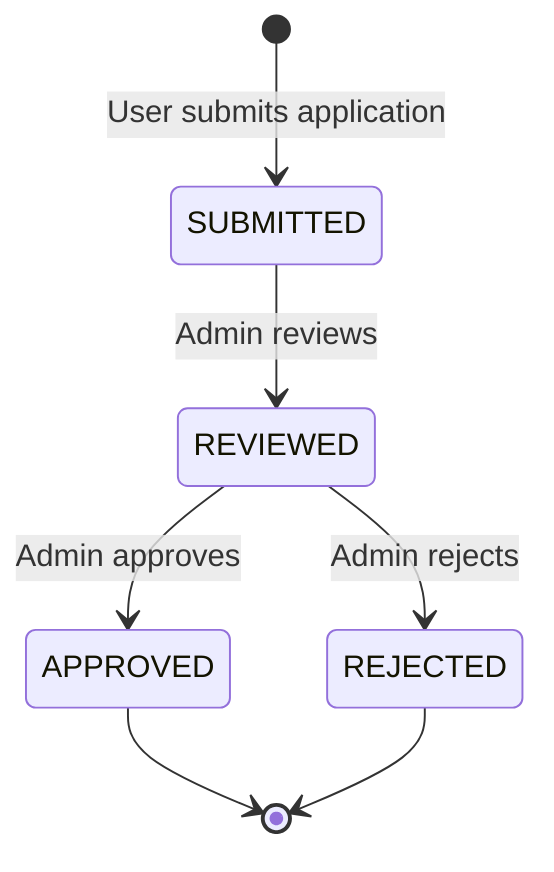

# User API Documentation

## Overview

This document describes the user-related API endpoints for the Pluto Hub platform. These endpoints handle user authentication, profile management, and developer registration.

**Architecture**:
- **PostgreSQL + Prisma**: All user data is stored in PostgreSQL database via Prisma ORM
- **Firebase Authentication**: Used exclusively for authentication (JWT token generation and verification)
- **Sync Flow**: Frontend sends Firebase auth token → Backend verifies token → Backend creates/retrieves user from PostgreSQL

---

## Firebase Authentication Flow

### How It Works

The authentication system uses Firebase for identity verification while storing all user data in PostgreSQL:

1. **Frontend**: User signs in with Firebase (email/password, Google, etc.)
2. **Frontend**: Obtains Firebase ID token from Firebase Auth SDK
3. **Frontend**: Sends token to backend in `Authorization: Bearer <token>` header
4. **Backend**: Verifies token with Firebase Admin SDK
5. **Backend**: Extracts `uid` from verified token
6. **Backend**: Queries PostgreSQL for user with matching `firebaseUid`
7. **Backend**: If user doesn't exist, creates new user in PostgreSQL with "PLAYER" role
8. **Backend**: Returns user data from PostgreSQL

### Frontend Implementation

```typescript
import { signInWithEmailAndPassword, getAuth } from 'firebase/auth';

// User signs in with Firebase
const auth = getAuth();
const userCredential = await signInWithEmailAndPassword(auth, email, password);

// Get ID token
const idToken = await userCredential.user.getIdToken();

// Send to backend
const response = await fetch('/v1/me/profile', {
  method: 'GET',
  headers: {
    'Authorization': `Bearer ${idToken}`,
  }
});

const userData = await response.json();
```

### Backend Implementation

The backend uses the following flow (already implemented in `packages/identity/src/interface/routes.ts`):

```typescript
// 1. Extract token from Authorization header
const authHeader = request.headers.authorization;
const token = authHeader.slice(7); // Remove 'Bearer '

// 2. Verify with Firebase Admin SDK
const verifyToken = new VerifyTokenUseCase(authProvider);
const decoded = await verifyToken.execute({ token });
// decoded = { uid: 'firebase-uid-123', email: 'user@example.com', ... }

// 3. Get or create user in PostgreSQL
const getOrCreateUser = new GetOrCreateUserUseCase(userRepo);
const user = await getOrCreateUser.execute({
  firebaseUid: decoded.uid,
  suggestedDisplayName: decoded.name
});

// 4. Return user from PostgreSQL
return user;
```

### Token Verification Details

- **Signature Verification**: Firebase Admin SDK verifies the token signature using Google's public keys
- **Expiration**: Tokens expire after 1 hour by default
- **Claims Validation**: Validates issuer, audience, and other standard JWT claims
- **User Sync**: `firebaseUid` is the primary link between Firebase Auth and PostgreSQL

### Token Refresh

Firebase tokens expire after 1 hour. The frontend should handle token refresh:

```typescript
// Automatically refresh token when needed
const idToken = await user.getIdToken(/* forceRefresh */ true);
```

---

## Authentication Endpoints

### Get Current User Profile

Retrieves the authenticated user's profile from PostgreSQL. Auto-creates user if this is their first request.

**Endpoint**: `GET /v1/me/profile`

**Authentication**: Required (Firebase Bearer token)

**Headers**:
```http
Authorization: Bearer <firebase-id-token>
```

**Response** (Existing User):
```json
{
  "id": "550e8400-e29b-41d4-a716-446655440000",
  "displayName": "CoolPlayer",
  "balance": "1000",
  "lockedBalance": "0",
  "createdAt": "2024-12-30T10:00:00Z"
}
```

**Response** (New User - Auto-created):
```json
{
  "id": "660e8400-e29b-41d4-a716-446655440001",
  "displayName": "Player_a8f3",
  "balance": "0",
  "lockedBalance": "0",
  "createdAt": "2024-12-31T09:08:00Z"
}
```

**Error Responses**:

| Status | Code | Description |
|--------|------|-------------|
| 401 | `UNAUTHORIZED` | Missing Authorization header |
| 401 | `INVALID_TOKEN` | Invalid or expired Firebase token |
| 500 | `INTERNAL_ERROR` | Database error |

**Example Error**:
```json
{
  "error": {
    "code": "INVALID_TOKEN",
    "message": "Firebase token is invalid or expired"
  }
}
```

**Notes**:
- Display name is auto-generated as `Player_<random>` if not provided by Firebase
- Display name is guaranteed to be unique across all users
- Balance and lockedBalance are returned as strings to preserve precision
- User is automatically created on first authentication (no separate registration endpoint needed)

---

## Developer Registration

### Submit Developer Application

Allows authenticated users to apply to become developers. Creates a developer application record in PostgreSQL.

**Endpoint**: `POST /v1/developer/register`

**Authentication**: Required (Firebase Bearer token)

**Headers**:
```http
Authorization: Bearer <firebase-id-token>
Content-Type: application/json
```

**Request Body**:
```json
{
  "companyName": "Awesome Games Studio",
  "website": "https://awesomegames.com",
  "description": "We create fun and engaging mobile games for all ages",
  "gamesPlanned": "Puzzle games, casual arcade titles, and educational games"
}
```

**Request Fields**:

| Field | Type | Required | Validation |
|-------|------|----------|------------|
| `companyName` | string | Yes | 3-100 characters |
| `website` | string | No | Valid URL format |
| `description` | string | Yes | 10-500 characters |
| `gamesPlanned` | string | Yes | 10-500 characters |

**Response** (Success):
```json
{
  "application": {
    "id": "770e8400-e29b-41d4-a716-446655440002",
    "userId": "550e8400-e29b-41d4-a716-446655440000",
    "email": "developer@studio.com",
    "companyName": "Awesome Games Studio",
    "website": "https://awesomegames.com",
    "description": "We create fun and engaging mobile games for all ages",
    "gamesPlanned": "Puzzle games, casual arcade titles, and educational games",
    "status": "SUBMITTED",
    "submittedAt": "2024-12-31T09:08:00Z"
  },
  "message": "Application submitted successfully. You will be notified once reviewed."
}
```

**Side Effects**:
- Creates record in PostgreSQL `DeveloperApplication` table
- Sets application `status` to "SUBMITTED"
- Links application to user via `userId` field
- Frontend can query user profile to check if `developerId` is populated

**Error Responses**:

| Status | Code | Description |
|--------|------|-------------|
| 400 | `VALIDATION_ERROR` | Invalid request body (see details) |
| 401 | `UNAUTHORIZED` | Invalid or missing Firebase token |
| 409 | `ALREADY_REGISTERED` | User already has a pending or approved application |
| 500 | `INTERNAL_ERROR` | Database error |

**Example Validation Error**:
```json
{
  "error": {
    "code": "VALIDATION_ERROR",
    "message": "Invalid request body",
    "details": {
      "companyName": ["Company name must be at least 3 characters"],
      "description": ["Description is required"]
    }
  }
}
```

**Example Duplicate Application Error**:
```json
{
  "error": {
    "code": "ALREADY_REGISTERED",
    "message": "You already have a developer application. Current status: SUBMITTED"
  }
}
```

**Application Status Flow**:



**Checking Application Status**:

Frontend can check the user's developer application status by:

1. **Check user profile**: If `developerId` is populated, user has an application
2. **Query application endpoint** (to be implemented): `GET /v1/developer/application`

---

## User Profile Fields

### User Object

| Field | Type | Description |
|-------|------|-------------|
| `id` | string (UUID) | Unique user ID in PostgreSQL |
| `firebaseUid` | string | Firebase Auth UID (not returned in API responses) |
| `displayName` | string | Unique display name |
| `balance` | string | Available balance in coins (string for precision) |
| `lockedBalance` | string | Balance locked in active games (string for precision) |
| `developerId` | string \| null | Reference to developer application (if approved) |
| `developerBalance` | string | Developer earnings balance (default: "0") |
| `developerStatus` | string \| null | Developer account status: "ACTIVE" or "BLOCKED" |
| `createdAt` | string (ISO 8601) | Account creation timestamp |

### Developer-Specific Fields

These fields are only populated after a user's developer application is approved:

- **`developerId`**: References the approved `DeveloperApplication` record
- **`developerBalance`**: Separate balance for developer earnings from game revenue
- **`developerStatus`**: 
  - `"ACTIVE"`: Developer can publish and manage games
  - `"BLOCKED"`: Developer account is suspended (admin action)
  - `null`: User is not a developer

---

## Error Response Format

All errors follow this standard format:

```json
{
  "error": {
    "code": "ERROR_CODE",
    "message": "Human-readable error message",
    "details": {}  // Optional, for validation errors
  }
}
```

### Common Error Codes

| Code | Status | Description | When It Occurs |
|------|--------|-------------|----------------|
| `UNAUTHORIZED` | 401 | Missing authentication | No Authorization header provided |
| `INVALID_TOKEN` | 401 | Invalid Firebase token | Token expired, malformed, or revoked |
| `VALIDATION_ERROR` | 400 | Invalid request body | Missing required fields or invalid format |
| `ALREADY_REGISTERED` | 409 | Duplicate action | User already has a developer application |
| `FORBIDDEN` | 403 | Access denied | User lacks required permissions |
| `NOT_FOUND` | 404 | Resource not found | Requested resource doesn't exist |
| `INTERNAL_ERROR` | 500 | Server error | Database or internal service error |

---

## Best Practices

### Frontend Integration

1. **Store Firebase Token Securely**
   - Use Firebase SDK's built-in token management
   - Don't store tokens in localStorage (Firebase SDK handles this)

2. **Handle Token Expiration**
   ```typescript
   // Automatically refresh expired tokens
   const idToken = await user.getIdToken(/* forceRefresh */ false);
   ```

3. **Handle Authentication Errors**
   ```typescript
   if (response.status === 401) {
     // Token expired, refresh and retry
     const newToken = await user.getIdToken(true);
     // Retry request with new token
   }
   ```

4. **Check Developer Status**
   ```typescript
   const profile = await fetch('/v1/me/profile', {
     headers: { 'Authorization': `Bearer ${idToken}` }
   }).then(r => r.json());
   
   if (profile.developerId) {
     // User has a developer application
     if (profile.developerStatus === 'ACTIVE') {
       // Show developer dashboard
     } else if (profile.developerStatus === null) {
       // Application pending review
     }
   }
   ```

### Backend Integration

1. **Always Verify Tokens**
   - Never trust client-provided user IDs
   - Always extract user ID from verified Firebase token

2. **Use Transactions for Balance Updates**
   - Balance and lockedBalance must be updated atomically
   - See [Bank API documentation](../api.md) for ledger operations

3. **Handle User Creation Gracefully**
   - User auto-creation is idempotent
   - Multiple simultaneous requests won't create duplicates (unique constraint on `firebaseUid`)

---

## Related Documentation

- [Main API Documentation](../api.md) - Bank, Lobby, and Contract APIs
- [Setup Guide](../SETUP.md) - Environment setup and configuration
- [Identity Package Schema](../../packages/identity/schema.md) - Database schema details
- [Prisma Schema](../../prisma/schema.prisma) - Complete database schema

---

## Support

For questions or issues:
- Check the [main API documentation](../api.md)
- Review the [Prisma schema](../../prisma/schema.prisma)
- Contact the platform team
