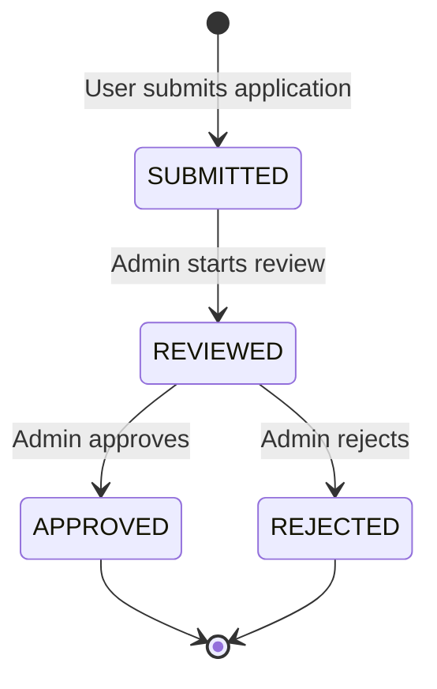

# Identity Package Schema Documentation

## Overview

This document describes the database schema for the Identity package in the Pluto Hub platform. The Identity package manages user authentication, profiles, and developer applications.

**Database**: PostgreSQL  
**ORM**: Prisma  
**Authentication**: Firebase Authentication (token verification only)

---

## User Model

The `User` model represents all users in the system, including players, developers, and admins.

### Schema Definition

```prisma
model User {
  id                String   @id @default(uuid())
  firebaseUid       String   @unique
  uniqueDisplayName String   @unique
  balance           BigInt   @default(0)
  lockedBalance     BigInt   @default(0)
  
  // Developer-specific fields
  developerId       String?  @unique
  developerBalance  BigInt   @default(0)
  developerStatus   DeveloperStatus?
  
  createdAt         DateTime @default(now())
  updatedAt         DateTime @updatedAt

  // Relations
  ledgerEntries         LedgerEntry[]
  lobbyPlayers          LobbyPlayer[]
  gameSessions          GameSessionPlayer[]
  developerApplication  DeveloperApplication? @relation(fields: [developerId], references: [id])
}

enum DeveloperStatus {
  ACTIVE
  BLOCKED
}
```

### Field Descriptions

| Field | Type | Description | Default | Constraints |
|-------|------|-------------|---------|-------------|
| `id` | UUID | Primary key, auto-generated | `uuid()` | Primary key |
| `firebaseUid` | String | Firebase Authentication UID | - | Unique, required |
| `uniqueDisplayName` | String | Unique display name for the user | - | Unique, required |
| `balance` | BigInt | Available balance in coins | `0` | Non-negative |
| `lockedBalance` | BigInt | Balance locked in active games | `0` | Non-negative |
| `developerId` | UUID | Reference to approved developer application | `null` | Unique, nullable |
| `developerBalance` | BigInt | Developer earnings balance | `0` | Non-negative |
| `developerStatus` | Enum | Developer account status | `null` | Nullable |
| `createdAt` | DateTime | Account creation timestamp | `now()` | Auto-generated |
| `updatedAt` | DateTime | Last update timestamp | `now()` | Auto-updated |

### Developer-Specific Fields

#### `developerId`
- **Purpose**: Links user to their approved developer application
- **Populated**: When admin approves a developer application
- **Null**: User is not a developer or application not approved
- **Unique**: One user can only have one developer application

#### `developerBalance`
- **Purpose**: Separate balance for developer earnings from game revenue
- **Usage**: Platform fees, game revenue shares
- **Independent**: Not affected by player balance operations
- **Default**: `0` for all users

#### `developerStatus`
- **Purpose**: Controls developer account access
- **Values**:
  - `ACTIVE`: Developer can publish and manage games
  - `BLOCKED`: Developer account suspended (admin action)
  - `null`: User is not a developer
- **Admin-Only**: Only admins can modify this field

### User Creation Flow

1. User authenticates with Firebase (frontend)
2. Frontend sends Firebase ID token to backend
3. Backend verifies token with Firebase Admin SDK
4. Backend checks if user exists in PostgreSQL by `firebaseUid`
5. If not exists:
   - Create new user with auto-generated `uniqueDisplayName`
   - Set `balance` and `lockedBalance` to `0`
   - Set all developer fields to `null` or default values
6. Return user data from PostgreSQL

### Display Name Generation

- **Auto-generated**: `Player_<random>` if not provided by Firebase
- **Uniqueness**: Ensured by database unique constraint
- **Collision Handling**: Backend retries with new random suffix if collision occurs
- **User-Changeable**: Users can update via `/v1/me/display-name` endpoint

---

## DeveloperApplication Model

The `DeveloperApplication` model stores developer registration applications.

### Schema Definition

```prisma
model DeveloperApplication {
  id            String   @id @default(uuid())
  userId        String   @unique
  email         String
  companyName   String
  website       String?
  description   String
  gamesPlanned  String
  status        ApplicationStatus @default(SUBMITTED)
  submittedAt   DateTime @default(now())
  reviewedAt    DateTime?
  reviewedBy    String?
  reviewNotes   String?
  
  createdAt     DateTime @default(now())
  updatedAt     DateTime @updatedAt
  
  // Relations
  user          User?
  
  @@index([status])
}

enum ApplicationStatus {
  SUBMITTED
  REVIEWED
  APPROVED
  REJECTED
}
```

### Field Descriptions

| Field | Type | Description | Default | Constraints |
|-------|------|-------------|---------|-------------|
| `id` | UUID | Primary key, auto-generated | `uuid()` | Primary key |
| `userId` | UUID | Reference to User who submitted | - | Unique, required |
| `email` | String | Developer contact email | - | Required |
| `companyName` | String | Company or studio name | - | Required, 3-100 chars |
| `website` | String | Company website URL | `null` | Nullable, valid URL |
| `description` | String | About the developer/studio | - | Required, 10-500 chars |
| `gamesPlanned` | String | Description of planned games | - | Required, 10-500 chars |
| `status` | Enum | Application review status | `SUBMITTED` | Required |
| `submittedAt` | DateTime | Submission timestamp | `now()` | Auto-generated |
| `reviewedAt` | DateTime | Review completion timestamp | `null` | Nullable |
| `reviewedBy` | UUID | Admin user ID who reviewed | `null` | Nullable |
| `reviewNotes` | String | Admin notes on application | `null` | Nullable |
| `createdAt` | DateTime | Record creation timestamp | `now()` | Auto-generated |
| `updatedAt` | DateTime | Last update timestamp | `now()` | Auto-updated |

### Application Status Flow



#### Status Descriptions

- **`SUBMITTED`**: Initial status when user submits application
- **`REVIEWED`**: Admin has reviewed but not yet made final decision
- **`APPROVED`**: Application approved, user becomes developer
- **`REJECTED`**: Application rejected, user remains player

### Application Approval Process

When an admin approves a developer application:

1. Update `DeveloperApplication.status` to `APPROVED`
2. Set `DeveloperApplication.reviewedAt` to current timestamp
3. Set `DeveloperApplication.reviewedBy` to admin's user ID
4. Update `User.developerId` to reference the approved application
5. Set `User.developerStatus` to `ACTIVE`

### Constraints

- **One Application Per User**: `userId` is unique
- **Status Index**: Indexed for efficient filtering by status
- **Email Validation**: Should be validated before insertion
- **URL Validation**: `website` should be validated if provided

---

## TypeScript Interfaces

### UserProfile

Used for API responses and internal user representation.

```typescript
export interface UserProfile {
  id: string;
  firebaseUid: string;
  uniqueDisplayName: string;
  balance: bigint;
  lockedBalance: bigint;
  developerId: string | null;
  developerBalance: bigint;
  developerStatus: DeveloperStatus | null;
  createdAt: Date;
}
```

### UserProfileResponse

API response format (balances as strings for JSON serialization).

```typescript
export interface UserProfileResponse {
  id: string;
  displayName: string;
  balance: string;
  lockedBalance: string;
  developerId: string | null;
  developerBalance: string;
  developerStatus: DeveloperStatus | null;
  createdAt: string; // ISO 8601
}
```

### DeveloperApplicationInput

Input for creating a developer application.

```typescript
export interface DeveloperApplicationInput {
  companyName: string;      // 3-100 characters
  website?: string;          // Optional, valid URL
  description: string;       // 10-500 characters
  gamesPlanned: string;      // 10-500 characters
}
```

### DeveloperApplicationResponse

API response for developer application.

```typescript
export interface DeveloperApplicationResponse {
  id: string;
  userId: string;
  email: string;
  companyName: string;
  website: string | null;
  description: string;
  gamesPlanned: string;
  status: ApplicationStatus;
  submittedAt: string; // ISO 8601
  reviewedAt: string | null; // ISO 8601
  reviewedBy: string | null;
  reviewNotes: string | null;
}
```

### Enums

```typescript
export enum DeveloperStatus {
  ACTIVE = 'ACTIVE',
  BLOCKED = 'BLOCKED'
}

export enum ApplicationStatus {
  SUBMITTED = 'SUBMITTED',
  REVIEWED = 'REVIEWED',
  APPROVED = 'APPROVED',
  REJECTED = 'REJECTED'
}
```

---

## Database Migrations

### Adding Developer Fields to User Model

When adding the developer fields to the existing User model:

```sql
-- Add new columns
ALTER TABLE "User" 
  ADD COLUMN "developerId" TEXT,
  ADD COLUMN "developerBalance" BIGINT NOT NULL DEFAULT 0,
  ADD COLUMN "developerStatus" TEXT;

-- Add unique constraint
ALTER TABLE "User" 
  ADD CONSTRAINT "User_developerId_key" UNIQUE ("developerId");

-- Create enum type
CREATE TYPE "DeveloperStatus" AS ENUM ('ACTIVE', 'BLOCKED');

-- Update column type
ALTER TABLE "User" 
  ALTER COLUMN "developerStatus" TYPE "DeveloperStatus" 
  USING ("developerStatus"::"DeveloperStatus");
```

### Creating DeveloperApplication Table

```sql
-- Create enum type
CREATE TYPE "ApplicationStatus" AS ENUM ('SUBMITTED', 'REVIEWED', 'APPROVED', 'REJECTED');

-- Create table
CREATE TABLE "DeveloperApplication" (
  "id" TEXT NOT NULL PRIMARY KEY,
  "userId" TEXT NOT NULL UNIQUE,
  "email" TEXT NOT NULL,
  "companyName" TEXT NOT NULL,
  "website" TEXT,
  "description" TEXT NOT NULL,
  "gamesPlanned" TEXT NOT NULL,
  "status" "ApplicationStatus" NOT NULL DEFAULT 'SUBMITTED',
  "submittedAt" TIMESTAMP(3) NOT NULL DEFAULT CURRENT_TIMESTAMP,
  "reviewedAt" TIMESTAMP(3),
  "reviewedBy" TEXT,
  "reviewNotes" TEXT,
  "createdAt" TIMESTAMP(3) NOT NULL DEFAULT CURRENT_TIMESTAMP,
  "updatedAt" TIMESTAMP(3) NOT NULL
);

-- Create index
CREATE INDEX "DeveloperApplication_status_idx" ON "DeveloperApplication"("status");

-- Add foreign key
ALTER TABLE "User" 
  ADD CONSTRAINT "User_developerId_fkey" 
  FOREIGN KEY ("developerId") 
  REFERENCES "DeveloperApplication"("id") 
  ON DELETE SET NULL 
  ON UPDATE CASCADE;
```

---

## Indexes

### User Table

- **Primary Key**: `id`
- **Unique Indexes**:
  - `firebaseUid` - Fast lookup by Firebase UID
  - `uniqueDisplayName` - Enforce unique display names
  - `developerId` - One-to-one relationship with DeveloperApplication

### DeveloperApplication Table

- **Primary Key**: `id`
- **Unique Index**: `userId` - One application per user
- **Regular Index**: `status` - Filter applications by status

---

## Security Considerations

### Field Access Control

| Field | Read Access | Write Access |
|-------|-------------|--------------|
| `firebaseUid` | User (own), Admin | System only |
| `uniqueDisplayName` | Public | User (own) |
| `balance` | User (own), Admin | System only (via ledger) |
| `lockedBalance` | User (own), Admin | System only (via contracts) |
| `developerId` | User (own), Admin | System only (on approval) |
| `developerBalance` | User (own), Admin | System only (via revenue) |
| `developerStatus` | User (own), Admin | Admin only |

### Developer Application Access

- **Create**: Any authenticated user (if no existing application)
- **Read**: User (own application), Admin (all applications)
- **Update**: Admin only (for review)
- **Delete**: Admin only

---

## Related Documentation

- [User API Documentation](../../docs/api/user.md) - API endpoints and usage
- [Prisma Schema](../../prisma/schema.prisma) - Complete database schema
- [Main API Documentation](../../docs/api.md) - Bank, Lobby, and Contract APIs

---

## Migration Guide

### From Firestore to PostgreSQL

If migrating from Firestore:

1. **Export Firestore Data**
   ```bash
   gcloud firestore export gs://your-bucket/firestore-export
   ```

2. **Transform Data**
   - Map Firestore document IDs to PostgreSQL UUIDs
   - Convert Firestore Timestamps to PostgreSQL DateTime
   - Map Firestore `role` field to `developerStatus` enum

3. **Import to PostgreSQL**
   ```typescript
   // Example migration script
   for (const firestoreUser of firestoreUsers) {
     await prisma.user.create({
       data: {
         firebaseUid: firestoreUser.userId,
         uniqueDisplayName: firestoreUser.displayName,
         balance: BigInt(firestoreUser.balance),
         lockedBalance: BigInt(0),
         createdAt: firestoreUser.createdAt.toDate(),
       }
     });
   }
   ```

4. **Migrate Developer Applications**
   ```typescript
   for (const app of firestoreDeveloperApplications) {
     const application = await prisma.developerApplication.create({
       data: {
         userId: userIdMap[app.userId], // Map to PostgreSQL user ID
         email: app.email,
         companyName: app.companyName,
         website: app.website,
         description: app.description,
         gamesPlanned: app.gamesPlanned,
         status: app.status,
         submittedAt: app.submittedAt.toDate(),
       }
     });
     
     // Link approved applications to users
     if (app.status === 'APPROVED') {
       await prisma.user.update({
         where: { id: userIdMap[app.userId] },
         data: {
           developerId: application.id,
           developerStatus: 'ACTIVE'
         }
       });
     }
   }
   ```
